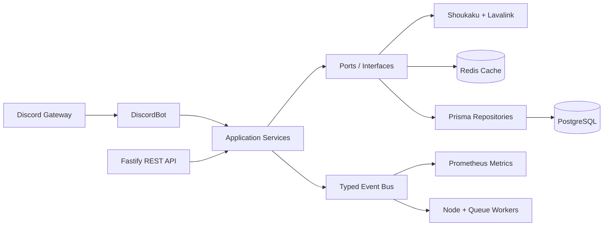
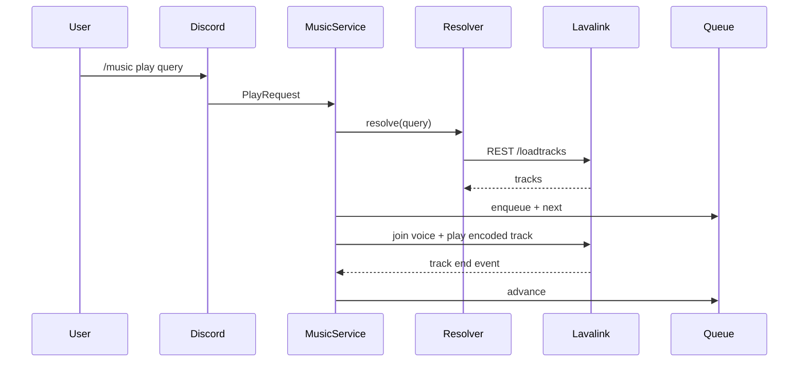

# Enterprise Discord Music Bot

Production-ready Discord music bot built with Node.js 22 LTS, TypeScript strict mode, Discord.js, Shoukaku, Lavalink, Prisma, PostgreSQL, Redis, Fastify, Prometheus, Pino, Zod, Vitest, Docker, and GitHub Actions.

## Documentation

- [中文 README](README.zh-CN.md)
- [中文安装部署教程：Ubuntu / Windows](docs/DEPLOYMENT.zh-CN.md)

## Features

- Lavalink-first playback with Shoukaku session resume, reconnect, load balancing, and node failover.
- Clean Architecture with repository, service, event-driven, and dependency-injection boundaries.
- Slash commands, buttons, select menus, modals, ephemeral replies, cooldowns, permissions, localization-ready command metadata, DJ mode, premium gates, role/channel restrictions.
- Queue persistence, auto resume, idle timeout, history, favorites, playlist import/export, autoplay, loop, jump, move, remove, shuffle, seek, volume.
- Audio filters: equalizer, bass boost, treble, nightcore, vaporwave, karaoke, rotation, echo, reverb, timescale, pitch/speed through Lavalink filters.
- PostgreSQL authority storage and Redis hot cache for queue/search/track metadata.
- REST API with Swagger, health/readiness, player, guild, queue, history, nodes, admin surfaces.
- Prometheus metrics, structured Pino logs, traceable API errors, graceful shutdown.

## Architecture



## Playback Flow



## Requirements

- Node.js 22 LTS
- pnpm 11+
- Docker and Docker Compose for local infrastructure
- Discord application token and client ID

## Quick Start

```bash
pnpm install
cp .env.example .env
pnpm db:generate
pnpm commands:register
docker compose up --build
```

For local development without the bot container:

```bash
docker compose up postgres redis lavalink
pnpm db:migrate:dev
pnpm commands:register
pnpm dev
```

## Configuration

Edit `.env`:

- `DISCORD_TOKEN`, `DISCORD_CLIENT_ID`: Discord application credentials.
- `DATABASE_URL`: PostgreSQL connection string.
- `REDIS_URL`: Redis connection string.
- `LAVALINK_NODES`: JSON array of Lavalink nodes.
- `API_TOKEN`, `METRICS_TOKEN`: Bearer tokens for REST and metrics.
- Spotify/Apple Music/Deezer fields enable LavaSrc provider support.

## Commands

- `/ping`
- `/music play query`
- `/music pause`, `/music resume`, `/music stop`, `/music skip`, `/music previous`
- `/music remove position`, `/music move from to`, `/music clear`, `/music shuffle`
- `/music loop mode`, `/music autoplay enabled`, `/music volume value`, `/music seek seconds`
- `/music queue`, `/music now`, `/music history`, `/music favorite`
- `/effects preset`
- `/playlist import`, `/playlist export name`, `/playlist list`, `/playlist play name`, `/playlist delete name`
- `/admin settings`, `/admin djmode enabled`, `/admin default-volume value`, `/admin max-queue value`

## REST API

Swagger UI is served at `/docs`.

Use `Authorization: Bearer $API_TOKEN`:

- `GET /health`
- `GET /ready`
- `GET /api/player/:guildId`
- `POST /api/player/:guildId/play`
- `POST /api/player/:guildId/pause`
- `POST /api/player/:guildId/resume`
- `POST /api/player/:guildId/stop`
- `POST /api/player/:guildId/skip`
- `POST /api/player/:guildId/volume`
- `POST /api/player/:guildId/seek`
- `POST /api/player/:guildId/loop`
- `POST /api/player/:guildId/effects`
- `GET /api/guild/:guildId`
- `PATCH /api/guild/:guildId`
- `GET /api/history/:guildId`
- `GET /api/nodes`

Use `Authorization: Bearer $METRICS_TOKEN` for `GET /metrics`.

## Quality Gates

```bash
pnpm typecheck
pnpm lint
pnpm test
pnpm coverage
pnpm build
```

## Deployment

Ubuntu servers can use the bundled deployment script:

```bash
curl -fsSL https://raw.githubusercontent.com/PuneetGOTO/Ms-Bot-/main/scripts/deploy-ubuntu.sh -o deploy-ubuntu.sh
bash deploy-ubuntu.sh --register-commands
```

The Docker image runs migrations before starting:

```bash
docker compose up --build -d
```

For horizontal scale, run multiple bot/API workers with shard-aware Discord deployment, separate Lavalink nodes, shared PostgreSQL, shared Redis, and external load balancing for API traffic.

## Troubleshooting

- No audio: verify Lavalink is reachable and `/ready` reports connected nodes.
- Spotify/Apple/Deezer not resolving: set the LavaSrc provider secrets and restart Lavalink.
- Slash commands missing: run `pnpm commands:register`; global commands can take time to propagate.
- Prisma migration failure: check `DATABASE_URL`, PostgreSQL readiness, and `prisma/migrations/20260706000000_init/migration.sql`.
- Discord permission errors: verify the bot has connect/speak permissions and the user passes DJ/channel/role restrictions.
