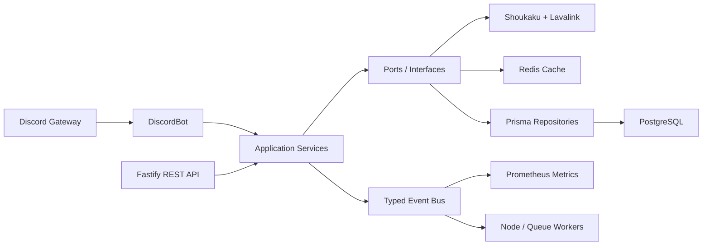
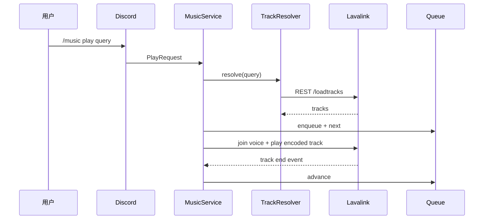

# Ms Bot

企业级 Discord 高音质音乐机器人，基于 Node.js 22 LTS、TypeScript strict mode、Discord.js、Shoukaku、Lavalink、Prisma、PostgreSQL、Redis、Fastify、Prometheus、Pino、Zod、Vitest、Docker 与 GitHub Actions 构建。

- English: [README.md](README.md)
- 安装部署教程： [docs/DEPLOYMENT.zh-CN.md](docs/DEPLOYMENT.zh-CN.md)

## 功能特色

- Lavalink 优先的音乐播放架构，不直接在 Bot 内处理音频源。
- Shoukaku Lavalink Gateway，支持 session resume、自动重连、节点状态监控与节点故障恢复。
- Clean Architecture，分离 domain、application、infrastructure、discord、api、workers 等边界。
- Repository Pattern、Service Pattern、Event Driven Architecture 与显式依赖注入。
- Slash Commands、按钮、选择菜单、Modal、Ephemeral 回复、冷却时间、权限校验、DJ 模式、角色/频道限制。
- 播放、暂停、继续、停止、跳过、上一首、移除、移动、清空、随机、循环、自动播放、音量、Seek、Jump。
- 播放清单导入/导出、收藏、历史记录、当前播放、队列持久化。
- 音效：Equalizer、Bass Boost、Treble、Nightcore、Vaporwave、Karaoke、Rotation、Echo、Reverb。
- PostgreSQL 持久化数据，Redis 缓存搜索、队列、歌曲元数据。
- Fastify REST API，包含 health、ready、player、guild、history、nodes 与 Swagger UI。
- Prometheus metrics、Pino structured logging、错误 trace、优雅关闭。

## 架构



## 播放流程



## 环境要求

- Node.js 22 LTS
- pnpm 11+
- Docker 与 Docker Compose
- Discord Application 的 Bot Token 与 Client ID

生产环境推荐使用 Docker Compose 部署 PostgreSQL、Redis、Lavalink 与 Bot。完整步骤请看 [安装部署教程](docs/DEPLOYMENT.zh-CN.md)。

## 快速启动

```bash
pnpm install
cp .env.example .env
pnpm db:generate
pnpm commands:register
docker compose up --build
```

开发时如果只想在本机跑 Bot，基础服务仍可用 Docker：

```bash
docker compose up postgres redis lavalink
pnpm db:migrate:dev
pnpm commands:register
pnpm dev
```

## 配置说明

复制 `.env.example` 为 `.env` 后填写：

- `DISCORD_TOKEN`：Discord Bot Token。
- `DISCORD_CLIENT_ID`：Discord Application Client ID。
- `DISCORD_GUILD_ID`：开发服务器 ID，可选；填了会注册 guild commands，刷新更快。
- `DATABASE_URL`：PostgreSQL 连接字符串。
- `REDIS_URL`：Redis 连接字符串。
- `LAVALINK_NODES`：Lavalink 节点 JSON 数组。
- `API_TOKEN`：REST API Bearer Token。
- `METRICS_TOKEN`：Prometheus `/metrics` Bearer Token。
- `SPOTIFY_CLIENT_ID`、`SPOTIFY_CLIENT_SECRET`、`APPLE_MUSIC_MEDIA_API_TOKEN`、`DEEZER_MASTER_DECRYPTION_KEY`：平台扩展所需凭据，默认可留空。

不要把真实 `.env` 推送到 GitHub。仓库只应该提交 `.env.example`。

## Discord 指令

- `/music play query`
- `/music pause`、`/music resume`、`/music stop`、`/music skip`、`/music previous`
- `/music remove position`、`/music move from to`、`/music clear`、`/music shuffle`
- `/music loop mode`、`/music autoplay enabled`、`/music volume value`、`/music seek seconds`
- `/music queue`、`/music now`、`/music history`、`/music favorite`
- `/effects preset`
- `/playlist import`、`/playlist export name`、`/playlist list`、`/playlist play name`、`/playlist delete name`
- `/admin settings`、`/admin djmode enabled`、`/admin default-volume value`、`/admin max-queue value`

## REST API

Swagger UI 默认在：

```text
http://localhost:3000/docs
```

普通 API 使用：

```http
Authorization: Bearer <API_TOKEN>
```

监控指标使用：

```http
Authorization: Bearer <METRICS_TOKEN>
```

常用接口：

- `GET /health`
- `GET /ready`
- `GET /metrics`
- `GET /api/player/:guildId`
- `POST /api/player/:guildId/play`
- `POST /api/player/:guildId/pause`
- `POST /api/player/:guildId/resume`
- `POST /api/player/:guildId/stop`
- `POST /api/player/:guildId/skip`
- `POST /api/player/:guildId/volume`
- `POST /api/player/:guildId/seek`
- `POST /api/player/:guildId/loop`
- `POST /api/player/:guildId/effects`
- `GET /api/guild/:guildId`
- `PATCH /api/guild/:guildId`
- `GET /api/history/:guildId`
- `GET /api/nodes`

## 质量检查

```bash
pnpm typecheck
pnpm lint
pnpm test
pnpm coverage
pnpm build
```

## Docker 部署

```bash
docker compose up --build -d
docker compose logs -f bot
```

关闭测试环境但保留数据卷：

```bash
docker compose down
```

关闭并删除数据卷：

```bash
docker compose down -v
```

正式部署请优先阅读 [Ubuntu / Windows 安装部署教程](docs/DEPLOYMENT.zh-CN.md)。

## 故障排除

- Bot 没上线：检查 `DISCORD_TOKEN`、容器日志、服务器能否访问 Discord。
- Slash Commands 不显示：运行 `pnpm commands:register`，全局指令可能需要等待 Discord 缓存刷新。
- Bot 不进语音频道：确认用户在语音频道内，Bot 有 Connect/Speak 权限，并查看日志是否出现 `Joining voice channel.`。
- 没有声音：检查 `/ready` 是否显示 Lavalink 节点 `connected: true`。
- 查不到歌曲：检查 Lavalink 日志、URL 是否可访问、对应 source 是否启用。
- PostgreSQL 迁移失败：检查 `DATABASE_URL` 与 PostgreSQL health。
- Redis 错误：检查 `REDIS_URL` 与 Redis 容器状态。

## 开源安全提醒

- 不要提交 `.env`。
- 不要提交 Discord Token、API Token、数据库密码、Lavalink 密码。
- 生产环境请修改默认 PostgreSQL 密码与 Lavalink auth。
- GitHub Actions 或服务器部署请使用 Secrets 管理敏感值。
